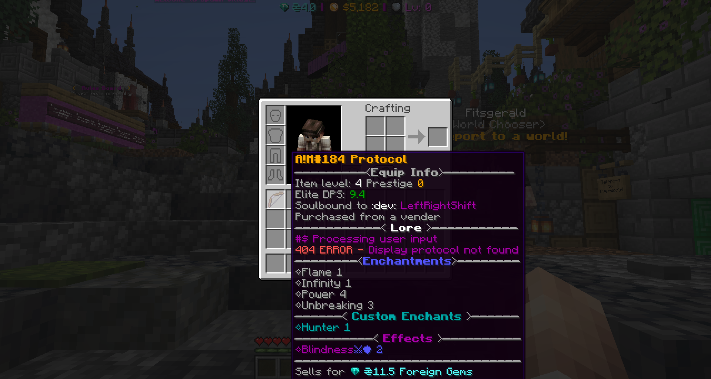

# Elite Items

Elite items are easily identifiable by the extentive lore that appears below an items name.

Example of an elite weapon:

<figure><figcaption></figcaption></figure>

Explanation of Elite Item details:

_Item name_\
~~**--------------**~~**(Equip Info)**~~**-----------**~~\
**Item level:** _4 (This is the level the item dropped at, contributing to your overall level) Also see_ [_Prestige_](../need-to-knows.md)\
**Elite DPS:** _Amount of Damage per strike_\
**Soulbound to:** _(See_ [_Soulbound_](soulbound.md) _info)_\
**Item obtained by method:** _(Could be Elite details or from a vender)_\
~~**---------------**~~**(Lore)**~~**---------------**~~\
_Item lore description_\
~~**-----------**~~**(Enchantments)**~~**---------**~~\
Any enchants that are applied to the item listed here\
**-------------(Effects)--------------**\
_Any potion effects that get applied on-hit or on-attack plus number equals level of potion_\
~~**------------------------------------**~~\
**Sells for:** The expected amount of Gems you'd get for selling.\

