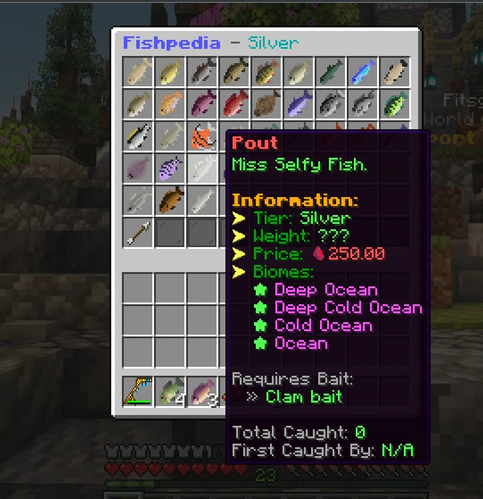

# Fishing

To get starting with the expanded fishing system, all you need is a Fishing Rod of any kind (Yes there is more than one type) and just cast your rod out to the water.

You will either catch a default vanilla fish or a custom one, If you are lucky to catch a custom fish, its name will be displayed in chat and telling you to checkout **/fish menu** .

<figure><figcaption>
The Fishing menu (Appearence subject to change)
</figcaption></figure>

The fishing menu will be your go-to menu for all things.&#x20;

For an added shortcut you can crouch and right click your fishing rod to open the menu!

## Fish Tier ranking

All custom fish belong to tiers, Bronze being lowest and Mythical highest

1. Bronze
2. Silver
3. Gold
4. Diamond
5. Platinum
6. Mythical

## Fishing conditions

Each custom fish is unique, each with their own name, custom texture and fishing conditions.\
Certain fish can only be fished in certain biomes or weather conditions to be obtained. \
Below is an example of a fish.

<figure><figcaption>
Brown Trout can only be caught in Rivers, Forests, Plains and Meadows.
</figcaption></figure>

### Fishing Requirements

Apart from Biome requirements for fish, you have to keep an eye out for Bait requirements, Purchasing the required bait and using while fishing is still random. Read [more here](bait.md)
