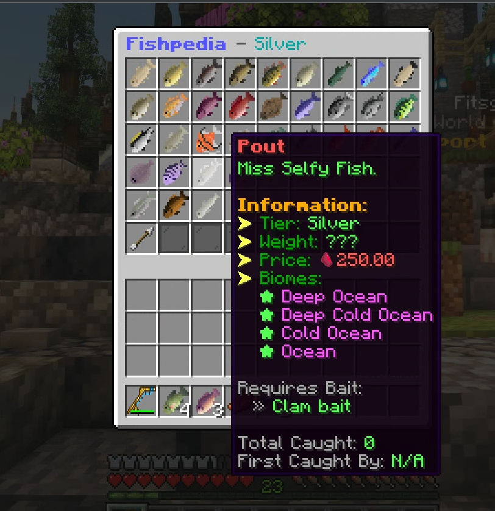

# Bait

Fish that require a bait to be caught can only be caught with the listed bait, Higher tiered baits don't capture any other category other than what they are listed as.

<figure><figcaption></figcaption></figure>

In order to purchase baits you must level up your skills to the required level and have enough Entropy to purchase.

<figure><figcaption>
Usage is not final,subject to change.
</figcaption></figure>

Baits do have limited usage, and can be applied to only one fishing rod at a time, Each custom fish you capture will consume a peice of bait.\
\
You can purchase multiple baits and apply them individually to other fishing rods if you desire.
