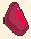

# Economy

Entropy is the main currency used for all fishing systems.

<figure><figcaption>
Entropy icon
</figcaption></figure>

Entropy is used for all upgrade, purchases (including [Baits](bait.md), [Augments](../augments.md)) and [selling](../selling.md).
