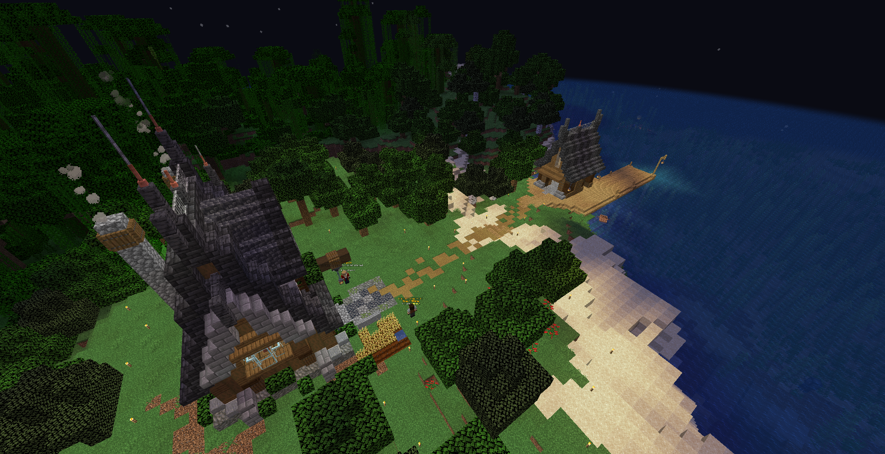

# Tournys

Tournys or Tournaments are special fishing events that occur near the Overworld spawn point at the fishing dock.

<figure><figcaption>
Left is the Overworld spawnpoint and the Right is the spawn dock.
</figcaption></figure>

To partake in a Tourny, you must first catch a fish around the dock area and you will be shown a timer for how long the Tourny will last.

<figure><figcaption>
Example of countdown bar, after engaging in a Tourny.
</figcaption></figure>

Each Tourny will have a different objective, ranging from Shortest fish to Most fish etc..

Rewards will be given to 1st, 2nd & 3rd place with a small bonus for players participating thereafter.
