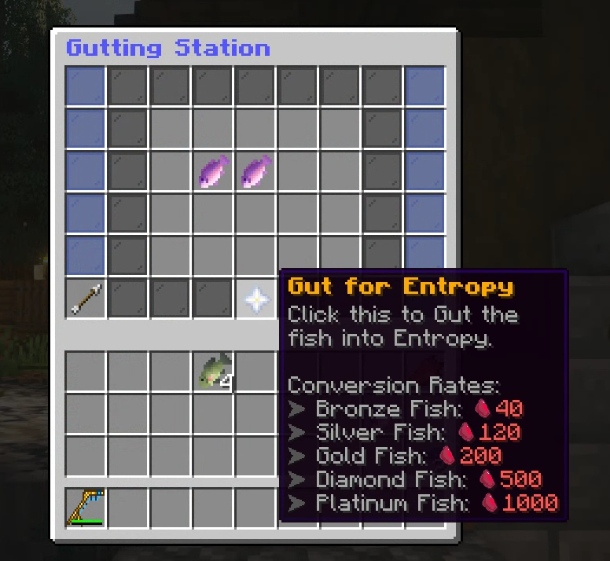
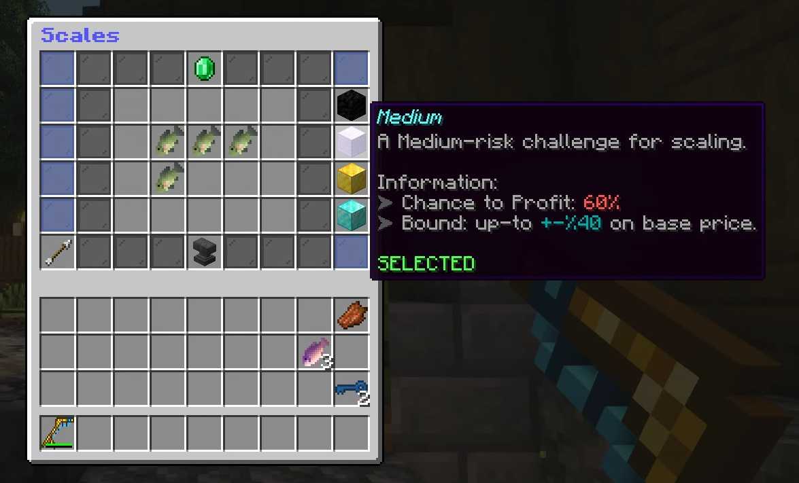
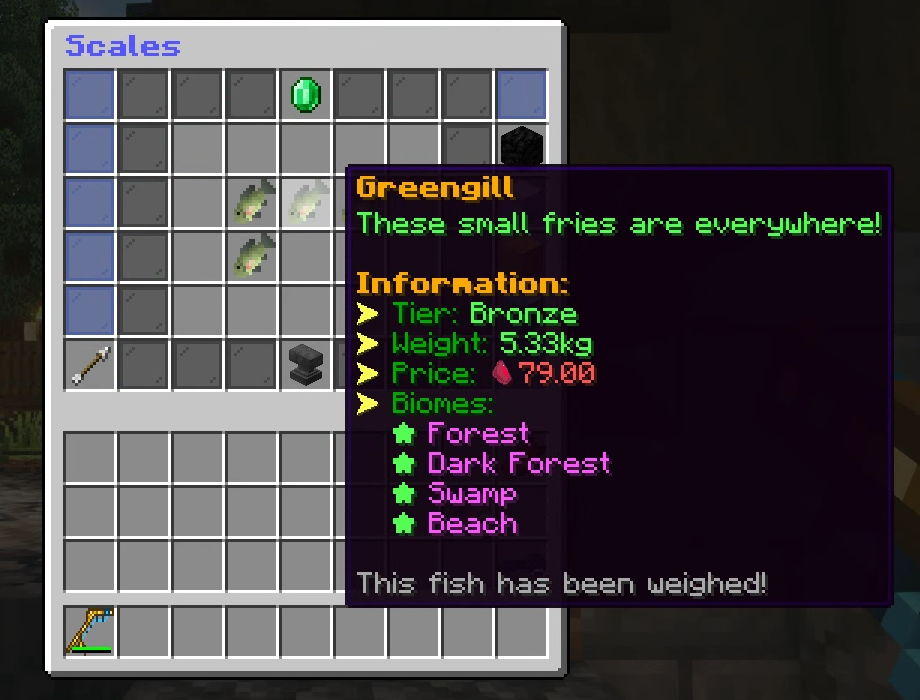
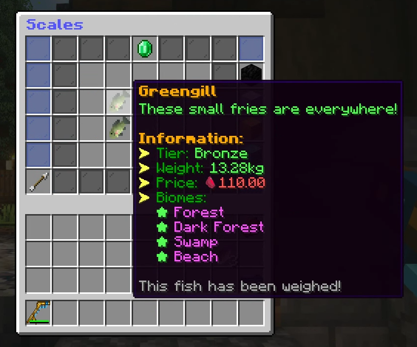

# Gutting and scaling

## Gutting fish

Gut your fish for bonus Entropy to craft and upgrade [Augments](augments.md)!

<figure><figcaption>
Gutting conversion rates.
</figcaption></figure>

## Scaling fish

Gamble with your fish for a chance to earn or lose money - Drop in the fish you want scaled and select a chance on the right.

<figure><figcaption>
Scaling chance on all fish placed on the scales.
</figcaption></figure>

After selecting the chance, Click on the anvil to weigh all fish in the GUI.

<figure><figcaption>
Weight of 5.33 Kg with medium chance resulted in 79 Entopy.
</figcaption></figure>

Depending on the weight of the fish and the chance chosen, the price will get set for that fish. \
You can then sell that fish for the listed price.

<figure><figcaption>
Weight of 13.28Kg with medium chance resulted in 110 Entropy.
</figcaption></figure>

When scaling, the heavier the fish the better!
