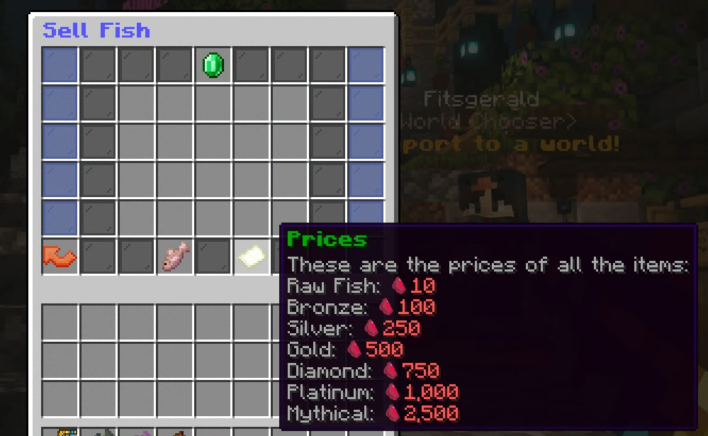

# Selling

After you catch a custom fish, You can check the lore on the fish which will show you the length or weight, These stats will have an impact on how much a fish will sell for.

You can sell the vanilla (raw fish) and custom fish to the shop NPC, or you have the option for Gutting or Scaling the fish for a chance for more profit.&#x20;

In the selling gui, you'll have plenty of room to put all the fish you caught into the GUI, You'll also notice at the bottom a selling guide (pictured below) and a fish icon. This icon is the special fish of the day, these will grant a bonus if caught and sold.

<figure><figcaption></figcaption></figure>

See more about [Gutting and Scalling](gutting-and-scaling.md)
