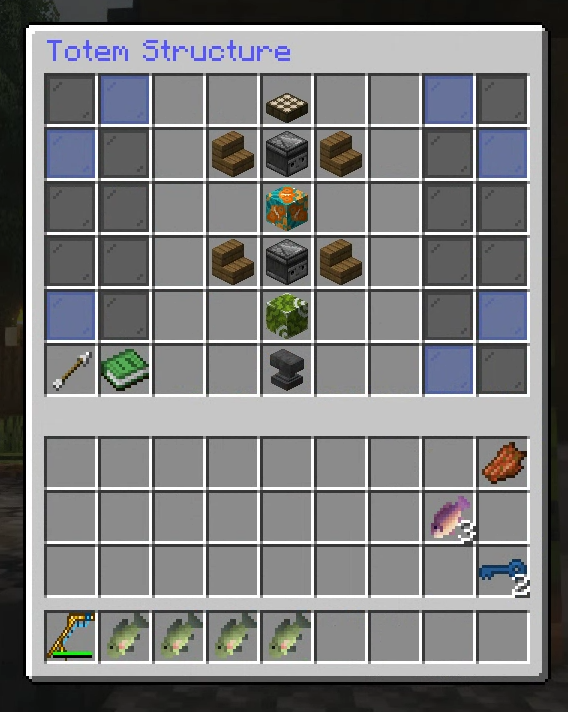
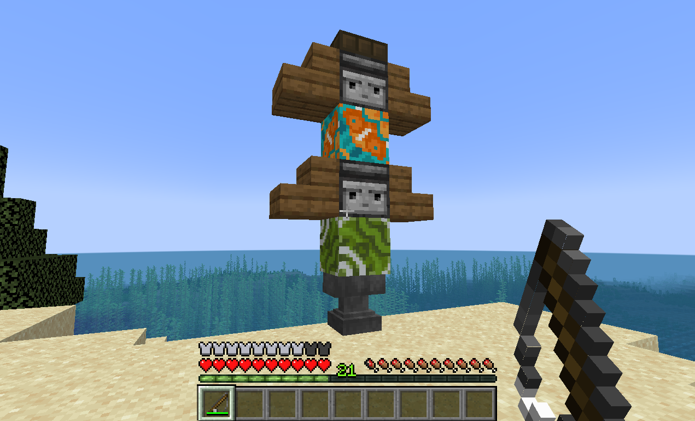
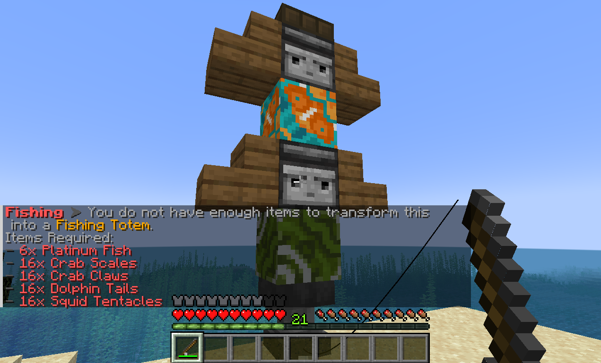
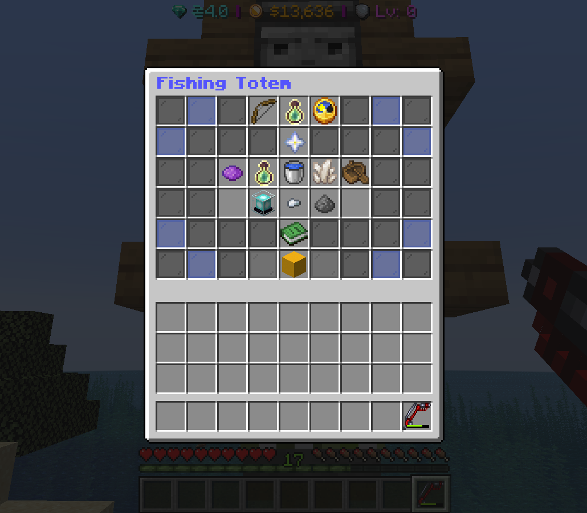

# Totems

Fishing totems are player built towers using blocks found in the fishing menu

<figure><figcaption>
How to build a totem.
</figcaption></figure>

<figure><figcaption></figcaption></figure>

After building the Totem correctly and you are **at/or above level 20**,&#x20;

Right click with your fishing rod on the bottom obvserver to interact with the Totem controls. \
There are further tasks you must complete (or have already) to active the totem.\

<figure><figcaption>
Requirements to activate a totem
</figcaption></figure>

After collecting all the items required, ensure they are all in your inventory and Right click with your fishingrod again to active it. This will now register the totem to you personally.

Once finally activated, Right clicking with your fishing rod will open up a GUI to enable certain power ups within a radius to provide bonus' with fishing (Similar to beacons) to anyone in the area.

<figure><figcaption></figcaption></figure>

Continue reading about totem upgrades and passives in the next page.
