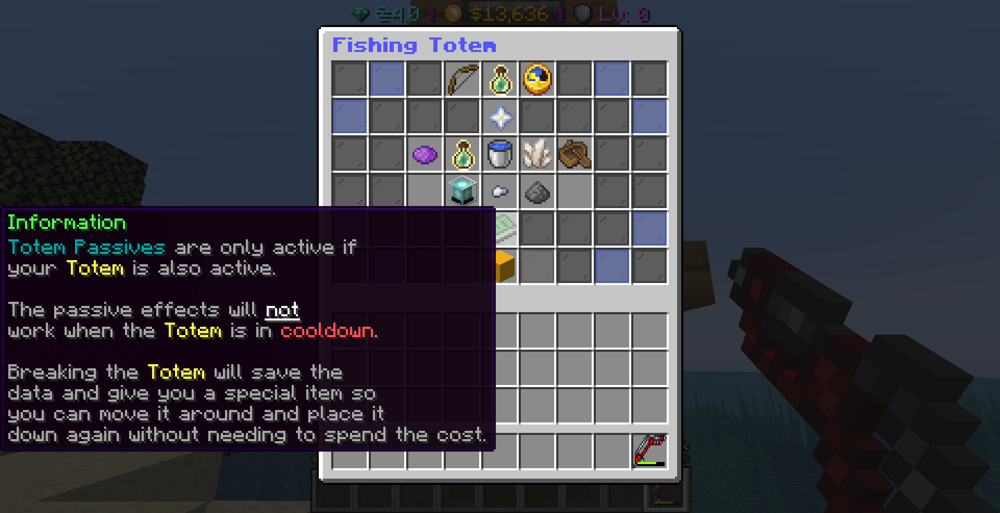
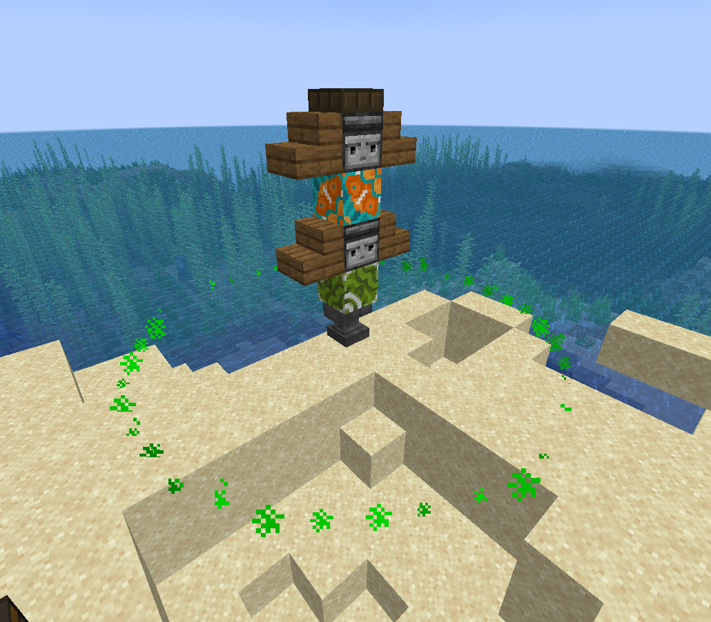

# Totem Passives

Totem passives are beacon-like powers that can be activated via the totem interface. These passives are only active when the item is not in cooldown.&#x20;

Also breaking the bottom observer in totem pole will save your current passives and cooldown and drop an item so that it can easily be built in another location.

<figure><figcaption></figcaption></figure>

<figure><figcaption>
Radius shown around an active totem
</figcaption></figure>

There are several features of Fishing totems and many upgrades possible too.

## Totem upgrades

### Totem radius:

By default, Totem radius' are set at 5 blocks around it,\
Fishing within the radius will grant the active effects.\
Max level: 5

### Active time:

By default, The active time is set at 5 minutes.\
This upgrades has the ability to extend the active time of effects, before the totem goes into cooldown.\
Max level: 20

### Cooldown reduction:

By default, Cool down is set at 1 hour after being active with the above upgrade time.\
Upgrading this will grant shorter cooldown times allowing you to use the totem passives sooner.

### Passive slots:

Passive slots are essentially like totem skill points, These are used for requirements set by the passive. Upgrading to more slots will enable you to enable multiple passives at the same time or allocate all slots to one passive.

\

## Passives:

Passives are powers unlocked with passive slots, each passive below has requirements, read about them below.

Mythical Waters

This passive will give you a chance when catching a fish to randomly upscale it to a higher tier fish.\
\
Passive slots required: 5\
Required fishing level: 60

Experienced Fisherman

This passive will increase the amount of fishing experience you get while fishing near the totem\
\
Passive slots required: 1\
Required fishing level: 20

Fish Schools

This passive will make the augment [Hot Spot](../augments.md#hot-spot-augment) activate more frequently.\
\
Passive slots required: 3\
Required fishing level: 40

Little Critters

This passive will give you a higher chance to get crab related loot from killing crabs in the radius.\
\
Passive slots required: 2\
Required fishing level: 40

Treasure Hunter

This passive will give you a chance when catching a fish to randomly find rare and random items / loot.\
\
Passive slots required: 3\
Required fishing level: 60

Star Fall

This passive will give you a chance when catching a fish to randomly summon a lightning bolt that summons a strong fish. Kill it to be rewarded with loot and lots of Entropy.\
\
Passive slots required: 10\
Required fishing level: 100

Entropy Horder

This passive will give you more Entropy from catching fish inside the totems radius.\
\
Passive slots required: 6\
Required fishing level: 60

Random Drops

This passive will give you a chance when killing crabs to randomly get squid, dolphin or other fishing loot.\
\
Passive slots required: 4\
Required fishing level: 55

