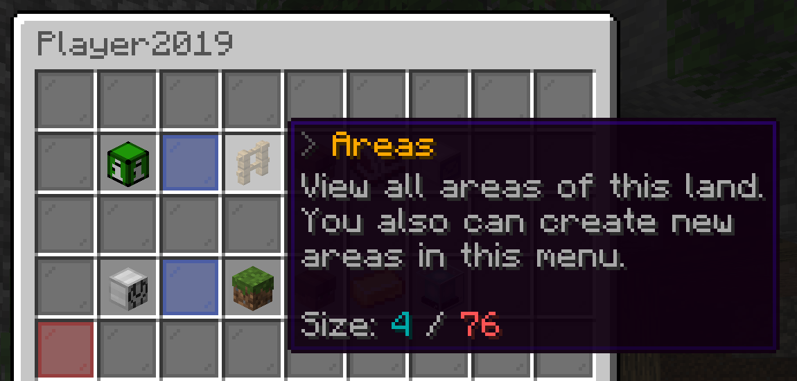

# Subareas

#### What is a Area?

Land areas are "sub areas/lands" inside a land. These areas are three dimensional, that means that they are not bound to chunks but instead to blocks. You can trust players to specific area(s) and apply flags for it, like you would do for a land.

#### Create a new Area

1. First open your land menu with /Lands menu and click on the areas item. Depending on your servers configuration of the GUI menus the item position may vary

\

2.  Now click on the add area button. After this you will need to enter the area name in chat.\

    \

    3\. After that you will notice that the area will popup in the menu and give you instructions how to set the size of it.\

    4\.
3.  &#x20;The selection is set. It will display it to you live. You can make changes as you wish. Then just execute /Lands selection assign . After that everything is setup.

    ###

    ###

    ### Trust Players and set Flags

    By opening the areas menu again and clicking on the area, you can trust players to this specific area and edit flags. You can do everything for this specific area, like it is a land.
